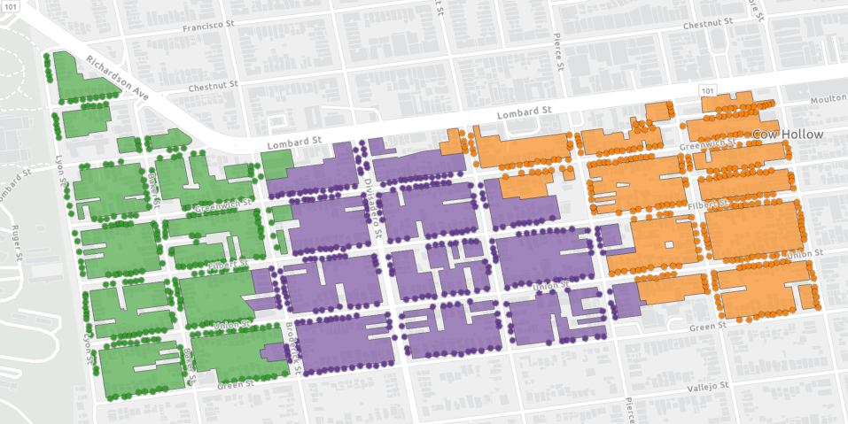

# Generate Route Geometry for Waste Collection – Help Documentation

## Overview
The **Generate Route Geometry for Waste Collection** tool creates polygons representing the area served by each route in a [Waste Collection network analysis layer](https://pro.arcgis.com/en/pro-app/latest/help/analysis/networks/waste-collection-analysis-layer.htm) in ArcGIS Pro. This enhances visualization and supports effective planning and communication of waste collection service areas.

The tool generates polygons either using information existing in the Waste Collection layer or using user-supplied parcel data, replacing existing geometry within the Routes sublayer of the Waste Collection layer.

The primary goal of this tool is to:
- Provide clear visual boundaries of waste collection routes for planners and field staff
- Easily communicate service areas to the public
- Aid in determining route coverage areas for households

## Software requirements
- ArcGIS Pro 3.5 or higher
- The Network Analyst extension license is required to solve a Waste Collection layer, which is a necessary input for this tool.  The tool itself does not require the Network Analyst extension license.
- The ArcGIS Pro Advanced license is required to run the tool when generating route geometry without parcel data as an input.  When using parcels, the tool can be run with the Basic license.

## Instructions

1. Download the latest release or clone the repo.
1. Open ArcGIS Pro and navigate to the project containing your solved Waste Collection layer.
1. Add the **FleetRoutingTools.pyt** toolbox from the downloaded or cloned repo to your project.
1. Locate the **Generate Route Geometry for Waste Collection** tool in the **FleetRoutingTools.pyt** toolbox.
1. Set the tool parameters and run the tool.  It updates the Routes sublayer of your Waste Collection layer.

## Polygon generation options

The tool provides two different methods for generating route polygons:
1. Use the data within the Waste Collection layer's sublayers
2. Use a user-provided feature class of parcels

### Generate polygons using the data within the Waste Collection layer's sublayers

The tool can generate polygons using only data included within the Waste Collection layer's sublayers.  The tool generates route polygons by identifying the network dataset edges the stops were located on and the routes the stops were assigned to and runs a series of geoprocessing tools to buffer those lines and handle overlaps.  This option does not require any additional data beyond what's already included in the solved Waste Collection layer.

The following image shows an example of output derived from using the data within the Waste Collection layer's sublayers.  The data used in this example is fictitious and presented only as an illustration of the tool's capabilities.

Warning: This method typically takes some time to run, potentially a few hours depending on the size of the problem.

Note: Because the polygons are generated based on the network locations of the stops and not their original geographic locations, it is possible that the geometry of the stops may fall outside the polygons generated for the routes to which they are assigned.  [Learn more about the network locations of analysis inputs.](https://pro.arcgis.com/en/pro-app/latest/help/analysis/networks/locating-analysis-inputs.htm)

### Generate polygons using parcels

The tool can generate polygons derived from a user-provided feature class of parcels.  The tool generates route polygons by selecting all parcels assigned to a route and combining the geometry of those parcels.  This option creates very clean polygons that match your city's parcels, but it requires you to provide parcel data and to configure your Waste Collection layer to associate the parcels with stops.

The following image shows an example of output derived from using parcels.  The data used in this example is fictitious and presented only as an illustration of the tool's capabilities.

To use this option, you must have a unique ID field in your parcel dataset, and you must have a field in the Stops sublayer of the Waste Collection layer populated with values that correspond to the IDs in your parcel dataset.  In other words, each stop must be associated with a parcel.

The recommended workflow is:
1. Identify a unique ID field in your parcel dataset.
1. Use the [Add Field To Analysis Layer](https://pro.arcgis.com/en/pro-app/latest/tool-reference/network-analyst/add-field-to-analysis-layer.htm) geoprocessing tool to add a new field to the Stops sublayer of the Waste Collection layer. The field should have the same type as the unique ID field in your parcel dataset.
1. When adding inputs to the Stops sublayer, use field mapping to populate the new field with the correct parcel ID field value. Alternatively, if your stops are already loaded into the Stops sublayer, use joins and field calculations to populate the correct values for the field.
1. Solve the analysis (if you haven't already done so).
1. Run the **Generate Route Geometry for Waste Collection** tool.

## Tool parameters

- **Waste Collection Layer** (Python: *wc_layer*) - The Waste Collection layer to add polygon geometry to. The Waste Collection Layer must be solved and must reference a network dataset stored locally on disk (not a service).
- **Use Parcels** (Python: *use_parcels*) - Enables the use of parcel geometry for more precise boundary polygons.
- **Parcel Data** (Python: *parcel_data*) - A feature class containing parcel data to use when generating route polygons.  The parcel feature class must include a field uniquely identifying each parcel that maps to a field in the Stops sublayer of the Waste Collection layer.  This parameter is required when the Use Parcels option is checked True.
- **Parcel Unique ID Field** (Python: *parcel_id*) - A field in the Parcel Data feature class uniquely identifying each parcel feature.  This parameter is required when the Use Parcels option is checked True.
- **Stops Parcel ID Field** (Python: *stops_id*) - A field in the Stops sublayer of the Waste Collection layer that maps each stop to a parcel feature in the Parcel Data feature class.  This parameter is required when the Use Parcels option is checked True.

## Tool output
The tool replaces the existing geometry within the input Waste Collection layer's Routes sublayer. The field values are not altered. Only the geometry is updated.

## Issues

Find a bug or want to request a new feature?  Please let us know by submitting an issue.

## Contributing

Esri welcomes contributions from anyone and everyone. Please see our [guidelines for contributing](https://github.com/esri/contributing).

## Licensing
Copyright 2025 Esri

Licensed under the Apache License, Version 2.0 (the "License");
you may not use this file except in compliance with the License.
You may obtain a copy of the License at

   http://www.apache.org/licenses/LICENSE-2.0

Unless required by applicable law or agreed to in writing, software
distributed under the License is distributed on an "AS IS" BASIS,
WITHOUT WARRANTIES OR CONDITIONS OF ANY KIND, either express or implied.
See the License for the specific language governing permissions and
limitations under the License.

A copy of the license is available in the repository's [license.txt](license.txt) file.
